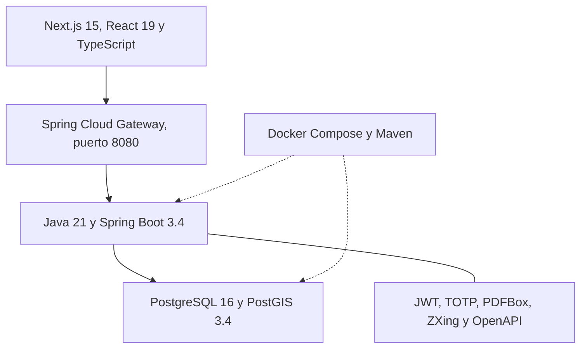

# Stack tecnológico

Corte del MVP: épica 1 (HU-01 a HU-08) y épica 3 (HU-18 a HU-25).

```mermaid
flowchart TB
  portal["Next.js 15, React 19 y TypeScript"]
  gateway["Spring Cloud Gateway, puerto 8080"]
  servicios["Java 21 y Spring Boot 3.4"]
  soporte["JWT, TOTP, PDFBox, ZXing y OpenAPI"]
  datos["PostgreSQL 16 y PostGIS 3.4"]
  infra["Docker Compose y Maven"]

  portal --> gateway --> servicios --> datos
  servicios --- soporte
  infra -.-> servicios
  infra -.-> datos
```
